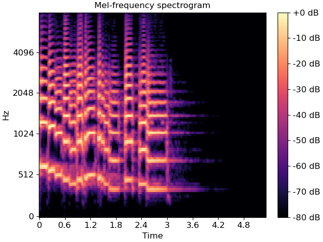

# Object-Oriented Programming for AI 2023-24 - final project requirements

In this final project, you will be required to implement a complex application in Python using the OOP concept explained in the course.
The project will need to contain the following elements:

- An implementation of a hierarchy of classes to manage datasets, mainly with Machine Learning as an end goal.
- A dataset wrapper, called `BatchLoader`, which handles the creation of batches of data for training a model.
- A set of preprocessing tools for image and audio data.

The deadline for the project is set on **Sunday February 4th, 2024 23:59 CET**, without exceptions.

This project is designed to be carried out in pairs.
The way you split the load is up to you; however, you should ensure that both team members' load is approximately equal.

The final product will need to be submitted as a **private** GitHub repository with the following structure:

- A `report.md` file at the root of your folder. The readme is to function as a submission report and a documentation for the usage of your code.
  - Here you should specify your implementation choices (e.g., why something has been implemented as a private/public attribute instead of a method argument, why you decided to create an intermediate class, why you chose to have an attribute public instead of private...).
  - Also, at the beginning of the report, you should detail how the workload was split between the two members.
- A `requirements.txt` file, listing all the dependencies of your project. This is to be formatted according to the [pip requirements file format](https://note.nkmk.me/en/python-pip-install-requirements/).
- A folder `src` containing all of the code for your library.
- A `main.py` file at the root of your folder. Here you should showcase an example of usage of your library.

## Git instructions

Please clone the project to your local machine (URL can be found under the green "Code" button):

```bash
git clone <URL>
```

If you want to push your changes to GitHub:

```bash
git add file.py         # to add one file
git add src/            # to add everything under 'src/'
git add .               # to add all changes
git status              # to check what you are pushing
git commit -m "this is a commit"
git push
```

For any Git-related issues, please go to the pull request that is open and tag @oop-otoz with your question in the comments.

## Datasets (3 pts.)

You will need to implement a hierarchy of classes to manage datasets.

- [ ] The implementation will need to contain a base class, defining all the methods and attributes common to all the datasets.
- [ ] Datasets should have two variants: one including both data and labels, the other including only the data (which can be used, e.g., for testing when there are no labels available).
- [ ] All datasets should include a `root` attribute, which identifies the root location where the data is stored into the disk. Each data point (e.g., an image, an audio file) should be stored as a single file in the disk, with the name of the file uniquely identifying the data point.
- [ ] The datasets should return the number of datapoints in it if passed to the `len` built-in function.
- [ ] Datasets can be used for both regression and classification.

  * In the case of **regression**, the data should be stored on disk in the `root` folder (and not any subfolder), with the labels stored in a separate file outside of the `root` folder.
    The labels should be stored in a single file **outside of `root`**, with the file in a `.csv` format.
    Each line contains information about a data point: the first column contains the filename and the second column containing the corresponding label.
  * In the case of **classification**, there are two possible formats:

    1.  As in the case of regression, the data is stored in a single folder, with the labels stored in a separate file outside of the `root` folder, in a `.csv` file formatted as above.
    2.  The data is stored in a folder hierarchy, with each subfolder containing the data for a single class. For instance, if we have three categories, the data is stored in a folder hierarchy as follows:

        ```
        root
        ├── class_1
        │   ├── data_1
        │   ├── data_2
        │   └── data_3
        ├── class_2
        │   ├── data_4
        │   ├── data_5
        │   └── data_6
        └── class_3
            ├── data_7
            ├── data_8
            └── data_9
        ```

        Notice that, in this specific configuration, you don't need a file with labels, since the labels are already encoded in the folder hierarchy.

        You should account for both of these configurations in your implementation.

- [ ] The datasets should be able to load the data from the disk, both in a **lazy** and in an **eager** fashion. The eager implementation should **load all the data into memory at once**, while the lazy implementation should store only the data path and **load the data from the disk only when needed**.
      _Notice that this implementation does not necessarily need to be implemented with the usage of iterators or generators._

- [ ] In all cases, the data should be accessed using the subsetting operator (e.g., `dataset[i]`), which should return (using the data structure you prefer) the data at the specified index. In the case of a dataset with labels, you should return both the data and the corresponding label. If the dataset has no labels, you should return only the data.

- [ ] The datasets should have a method for **splitting** the data (and labels, if applicable) into training and test sets. The user should be able to split the data by specifying the percentage of data to be used for training. This functionality should return two datasets as output (i.e. `train` and `test`).

- [ ] You should create at least two datasets with these characteristics, one handling **images**, the other handling **audio files**.

  * For handling images, you can use one of many Python libraries for image processing, such as [Pillow](https://pillow.readthedocs.io/en/stable/) or [OpenCV](https://opencv.org/). Notice that OpenCV, while faster than Pillow, is using the BGR format for images, while Pillow is using the standard RGB format. You should be careful that images loaded into the datasets are in the RGB format.

  * For handling audio files, you can use [Librosa](https://librosa.org/doc/latest/index.html), which is a Python library for audio processing. Notice that, for preprocessing reason, your data will be composed of a tuple (audio time series, sampling rate), which are the two fundamental inputs to Librosa preprocessing functions.

### BatchLoader class (3 pts.)

The BatchLoader will be constructed on top of a dataset, and will be responsible for creating batches of data for training a model using, e.g., Stochastic Gradient Descent.

- [ ] The BatchLoader should be able to create batches of data of a specified size.
- [ ] The user should specify whether they want the batches to be created in a **random** or in a **sequential** fashion:

  * In the case of **random** batches, the BatchLoader should create batches of data by randomly shuffling the order of the data points and then creating batches of the specified size.
  * In the case of **sequential** batches, no shuffling should be performed, and the batches should be created in the original order of the data points.

  Notice that, if `dataset_size // batch_size != 0` (i.e., the batch size is not a divisor of the dataset size), the last batch will be smaller than the specified batch size. You should let the user decide whether to use or to discard this last batch in case.

  

  The image above summarizes the process that the BatchLoader is tasked with carrying out, both for the random batches (shuffling is performed) and sequential batches (shuffling is not performed).

- [ ] Within the BatchLoader, the batches are to be created only using the **indices** of the data points, and the data composing the batch should be loaded from the disk only when needed using an iterator.

- [ ] If passed as argument to the `len` method, the BatchLoader should return the number of batches that can be created from the dataset with the specific batch size.

### Data preprocessing (3 pts.)

In this step, you are required to prepare at least **four** data preprocessing techniques as **callable classes** using OOP principles.

Have an ABC describing the generic behavior of the preprocessing tool.

Define your preprocessing technique as a class:

```python
class MyPreprocessingTechnique(PreprocessingTechniqueABC):
  def __init__(self, hyperparameter_1, hyperparameter_2):
    ...
```

The preprocessing technique should be used in this way:

```python
my_preproc_tech = MyPreprocessingTechnique(hyperparameter_1, hyperparameter_2)
new_data = my_preproc_tech(old_data)
```

- [ ] All the hyperparameters of these techniques---i.e., arguments that the user can specify for the transformations---**should be passed as arguments in the initialization**. The preprocessing technique, when called, **should have only data as arguments**, as in the snippet above.

- [ ] **Two classes** need to be for images.
- [ ] **Two classes** need to be for audio.
- [ ] In addition, you should create a datatype-agnostic preprocessing class that is able to sequentially perform multiple preprocessing steps.
      See the following subsections for more info.

#### Image preprocessing

Pick at least 2 of these:

For implementing these classes, use `opencv` (thus images will be represented by `numpy` arrays) or `Pilllow` (images can be representable by arrays by passing them to a `numpy.array` constructor).

1. Center crop: given an input image of any size `H` × `W`, return a cropped image of size `height` × `width`, whereas the center coordinates of the original image and the cropped image coincide. If the specified `height` **and** `width` are greater than the original image, the crop is not performed. In case, e.g., `H>height`, but `W<width`, then the crop is performed only on the height dimension. Below is an example of a 200 × 200 px center crop. After identifying the coordinates of the crop, you should return the image inside the red rectangle.


2. Random crop: given an input image of any size, return a cropped image of size `height` × `width`, whose coordinates of the top-left corner of the crop are sampled randomly. Be careful not to go out of the bounds of the original images. If the specified height and width are greater than the original image, the crop is not performed. Below is an example of a 200 × 200 px random crop. After identifying the coordinates of the crop, you should return the image inside the red rectangle.


3. Random patching: given an input image of any size, fill a window of the image with a pre-specified color. The top-left coordinate of this window is sampled randomly within the image. Let the user decide color, height and width of this window at initialization. Below is an example of random patching of size 30 × 39.


4. Padding: given an input image of any size `H` × `W`, if the image is smaller than a target height `height` or a target width `width`, fill the borders with a user pre-specified color until the image is of size `height` × `width`. In example below, the image was padded with blue bands up to a size of 400 × 500, whereas the starting size was 316 × 474.


5. Random flip: the image is flipped horizontally and vertically with a given probability `p`, specified by the user. Sample independently the event of horizontal and vertical flipping. In the example below, the image used before was flipped along its horizontal axis.


#### Audio preprocessing

Pick at least 2 of these.

1. Mel spectrogram: given an input audio track and a sampling rate, it should return a mel spectrogram of the given audio track. Mel spectrograms are a summary of the intensity of each frequency (on the mel scale, which is a human-perceptually meaningful sound frequency scale) of sound on each specific timestep of the audio track. Usually, they are used as input to Convolutional Neural Networks for audio data. You can see more info in [this video](https://www.youtube.com/watch?v=9GHCiiDLHQ4).



2. Random cropping: given an input audio track and a sampling rate, crop the audio sample on a random starting point for a given duration of `n` seconds. The output should be an audio track of duration `n` seconds and the same sampling rate. If the track is shorter than `n` seconds, than the original track is returned. Notice that the duration of the track can be easily recovered using librosa `get_duration` function.
3. Resampling: given an audio track and a sampling rate, it should return the resampled audio track with a different sampling rate. The operation is functionally similar to a resizing (scale up or down) of an image.
4. Pitch shifting: given an audio track and a sampling rate, shift the pitch by a user-specified factor.

#### Sequential application of preprocessing functions (pipeline)

As a last step, you should create a preprocessing class which implements a sequential pipeline of preprocessing steps.
This class takes as input (in the constructor) a variable number of preprocessing steps and applies them sequentially in the order they were passed.
Use the **variadic arguments** option to implement the constructor.
This class should have the same structure as any other preprocessing class (i.e. a callable class).
Be careful that the application of preprocessing steps may not be **commutative**: for instance, applying resampling on a Mel spectrogram will raise an error.

## Main (1 pt.)

In the main, you should showcase the usage of your library.

Notice that, for images and audio, showing means actually plotting some sample images, while, for audio, it refers to playing some sample audio tracks.

1. [ ] Create an image dataset and an audio dataset. Show how you can access your data. You may also plot some images using the `matplotlib.pyplot.imshow` method.

- Showcase a dataset with and without labels.
- Showcase a dataset for classification and regression.
- Showcase a lazy and an eager dataloader
- Build your datasets on top of whichever data you like (at least 100 data points); for the images, ensure that they have a size of at least 128 × 128 pixels.
  - To look for datasets, you can use tools like [Kaggle](kaggle.com), [PapersWithCode](paperswithcode.com), [Google Datasets](https://datasetsearch.research.google.com/), and [the Irvine Machine Learning Repository](https://archive.ics.uci.edu/).
  - You are even allowed to create your own dataset with the aforementioned requirements.
  - Be careful about the labels: you want simple labels and you want to find examples of both regression and classification datasets:
    - For images: object detection and segmentation are **not** image classification tasks; regression tasks can be, e.g., age estimation.
    - For audio: be careful not to use datasets for speech-to-text or other Natural Language Processing-related tasks (the labels are more complicated in this case); regression tasks can be for example [tempo estimation](https://github.com/CPJKU/BallroomAnnotations/blob/master/README.md).

2. [ ] Create a BatchLoader on top of two of these datasets (one for image, one for audio). Show its functionality with and without shuffling, with and without option to discard the last batch.
3. [ ] Create a pipeline of preprocessing steps, one for audio, one for images:

- Show how you can apply the pipeline on top of a BatchLoader output.
  ```python
  pipeline = ...
  for batch in batchloader:
    # apply the pipeline for the data in the batch
  ```
- Show how you can apply the pipeline on top of a Dataset samples
  ```python
  pipeline = ...
  for i in range(5):
    newdata = pipeline(dataset[i])
  ```


# Generic indications

Remind to always make use of the OOP concepts explained in the course:

- [ ] Always implement encapsulation accordingly. All the attributes should be private, and the user should be able to access them only through getters and setters. The usage of the `@property` decorator is preferrable. Motivate any choice of public methods and attributes in the report.
  - Remember type hints. Use the pipe operator `|` to concatenate multiple types. For collections, write inside brackets the expected type of elements (e.g., `List[int]`).
  - Also, don't forget about the return types (even when `None`).
- [ ] Make use of type checks. Code performing type checks should be better implemented as a private method, especially if repeated throughout the class.
  - If you repeat code throughout different classes, you can either create an external class handling these tasks, or, if you have small utility functions (e.g., check int, convert something into something else) you can create a `util.py` script and put the functions there (outside the objects is fine as well); you may later access the functions as `from util import <utility_function>`
- [ ] Make use of docstrings. Providing a documentation as HTML files (converted from the docstrings using software such as [sphinx](https://www.sphinx-doc.org/en/master/) or [napoleon](https://sphinxcontrib-napoleon.readthedocs.io/en/latest/)) will provide a bouns of +0.5 points to the final score.
- [ ] Take some moments for testing & refactoring. You don't need to use test-driven development for this project; nonetheless, you can still make use of specific tests to ensure that your code doesn't break when refactoring. Watch out for [code smells](https://refactoring.guru/refactoring/smells), especially bloaters [large class](https://refactoring.guru/smells/large-class) and [long method](https://refactoring.guru/smells/long-method).
  - Smells like [duplicate code](https://refactoring.guru/smells/duplicate-code) and [ḍead code](https://refactoring.guru/smells/dead-code) are particularly bad since they (i) hinder readability and (ii) makes it easier to create bugs. These will be taken into account when grading
  - Ignore the [Object-Orientation Abusers smell](https://refactoring.guru/refactoring/smells/oo-abusers) since this course is specifically focussed into OOP.
- [ ] As previously mentioned, use your report to motivate your decisions, like usage of public attributes or methods, unusual/nonintuitive choices on type hints, decisions to use classes not indicated in the requirements, etc.
- [ ] Attend the practicals for asking questions to the lecturers and the TAs.
- [ ] Check your emails often for announcements. There is no excuse for not reading your RUG email.


The minimum score for the project is 1.0; the maximum is 10.0. A grade higher than this score will be clipped to 10.0.
  - As per course information, the project grade is worth 40% of the final grade for this course.
